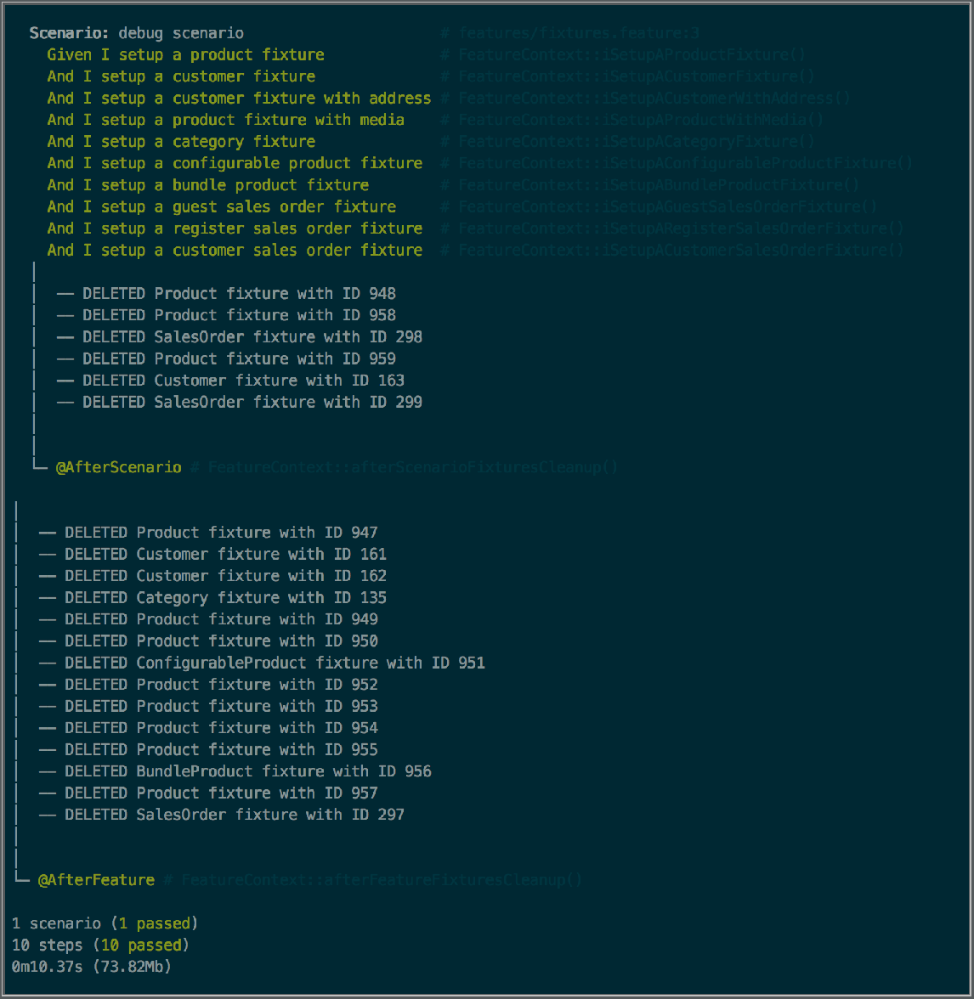
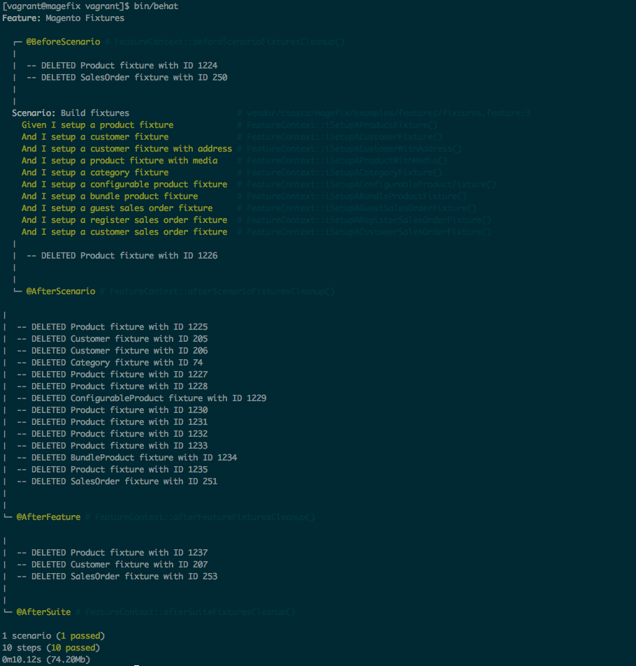

# Magefix - Magento's Behat Fixtures Library

A library to facilitate the creation of Magento fixtures for BehatMage. The following fixture types are currently available:

- Category
- Customer
- Simple Product
- Configurable Product
- Bundle Product
- Grouped Product
- Sales Order type Guest
- Sales Order type Register
- Sales Order type Customer
- Api Role
- Api User
- Admin User

[](https://scrutinizer-ci.com/g/ctasca/magefix/?branch=develop) [](https://scrutinizer-ci.com/g/ctasca/magefix/build-status/develop)

Please follow the below steps to get started, if you encounter any issues installing please check the [Common Issues](#common-issues) section first.

## Installation

### 1) Add Magefix to your composer.json

Add the following to your composer.json:

```yaml
...
"repositories": [
    {
        "type": "vcs",
        "url": "https://github.com/ctasca/magefix.git"
    }
],
...
```

```yaml
...
 "require-dev": {
    "ctasca/magefix": "dev-develop"
 },
 ...
```

### 2) Create the FixtureLocator

Create the FixtureLocator class in features/fixtures directory. This class has to provide a concrete implementation for
the `getLocation()` method specified in `Magefix\Parser\ResourceLocator` interface.

The getLocation method should return the path to the yml fixtures files. **IMPORTANT:** Make sure to end the path with a
forward slash.

Here is an example of a ResourceLocator:

```php
use Magefix\Parser\ResourceLocator;

class FixturesLocator implements ResourceLocator
{
    public function getLocation()
    {
        return 'features/fixtures/yaml/';
    }
}
```

### 3) Autoload FixtureLocator and feature/fixtures

In your `composer.json` add the following:

```yml
 "autoload": {
        "psr-0": {
            "": [
                ...
                "features/fixtures"
            ],
            ...
            "FixturesLocator" : "features/fixtures/FixturesLocator"
        }
    },
```

Run `composer dump-autoload` or `composer dumpautoload`  to regenerate autoload file.

**NOTE:** More than one FixtureLocator could be created. This depends mainly on a project requirements. To use different
fixture locators please refer to the [Creating Fixtures](#creating-fixtures) 
and [Using Many Locators](#using-many-locators) sections.

## Creating Fixtures

### 1) Create fixture yml

In the chosen fixture location, create a yml file containing the fixture definition. Examples of fixture's yml files can
be found in project's `examples` directory.

Here is an example for a Magento simple product fixture:

```yml
fixture:
    model: catalog/product
    data_provider: 'Data\Providers\SimpleProduct'
    attributes:
        name: 'Simple Product Fixture'
        description: 'Long Description'
        short_description: 'Short Description'
        weight: 10
        status: 1
        visibility: 4
        price: 100.00
        tax_class_id: 0
        website_ids: '{{getWebsiteIds}}'
        attribute_set_id : '{{getDefaultAttributeSetId}}'
        category_ids: '{{getCategoryIds}}'
        type_id: '{{getTypeId}}'
        sku: '{{getSku}}'
    stock:
        stock_data:
            qty: '{{getStockQty}}'
            is_in_stock: 1
            manage_stock: 1
```

### 2) Create Fixture's Data Provider

Most fixture nodes in fixtures's yml file can define dynamically generated values with the syntax `{{DATA_PROVIDER_METHOD}}`.
This means the value for the node will be dynamically assigned via the given Data Provider when the fixture's yml is parsed.

Simply, `Data Providers` are data-objects and should be added to the `features/fixtures` directory and provide any method
specified in the fixture's yml being parsed. A `ProviderMethodNotFound` exception is thrown if specified Data Provider 
does not have one or more methods as part of their protocol.

It is possible to switch data provider in scope in a fixtures's yml definitions, thus allowing to re-use existing
data providers. For example, when creating a Sales Order fixture, we may want to also create a product and customer fixture.

```yml
fixture:
    model: sales/quote
    data_provider: 'Data\Providers\SalesOrderCustomer'
    attributes:
        store_id: '{{getStoreId}}'
    quote_products:
        products:
            0:
                model: catalog/product
                data_provider: 'Data\Providers\SimpleProduct'
                attributes:
                    name: 'Simple Product Fixture'
                    description: 'Long Description'
                    short_description: 'Short Description'
                    weight: 10
                    status: 1
                    visibility: 4
                    price: 100.00
                    tax_class_id: 0
                    website_ids: '{{getWebsiteIds}}'
                    attribute_set_id : '{{getDefaultAttributeSetId}}'
                    category_ids: '{{getCategoryIds}}'
                    type_id: '{{getTypeId}}'
                    sku: '{{getSku}}'
                stock:
                    stock_data:
                        qty: 10
                        is_in_stock: 1
                        manage_stock: 1
    checkout:
        data_provider: 'Data\Providers\SalesOrderCustomer'
```


An example of a Data Provider:

```php
use Mage_Catalog_Model_Product_Type;
use Mage_Catalog_Model_Product_Visibility;
use Magefix\Fixtures\Data\Provider;

class SimpleProduct implements Provider
{
    public function getWebsiteIds()
    {
        return [1];
    }

    public function getDefaultAttributeSetId()
    {
        return 4;
    }

    public function getCategoryIds()
    {
        return [5, 14];
    }

    public function getSku()
    {
        $random = substr(md5(rand()), 0, 7);

        return 'SKU-' . $random;
    }

    public function getTypeId()
    {
        return Mage_Catalog_Model_Product_Type::TYPE_SIMPLE;
    }

    public function getStockQty()
    {
        return 10;
    }

    public function getFixtureImage()
    {
        return '/vagrant/features/fixtures/images/placeholder.jpg';
    }

    public function getVisibility()
    {
        return Mage_Catalog_Model_Product_Visibility::VISIBILITY_BOTH;
    }
}
```

### 3) Create Fixture in Behat's Feature class

To build the fixture during Behat run, edit the required Feature Context file and do the following:

#### 1) Add `use` statement and include Fixtures `Registry` and `Builder`

```php
use Magefix\Fixtures\Registry as FixturesRegistry;
use Magefix\Fixture\Factory\Builder as FixtureBuilder;
```

#### 2) Add `use` statement for Fixtures `Registry` trait

```php
/**
 * Default features context.
 */
class FeatureContext extends MagentoContext
{
    use FixturesRegistry;
```

#### 3) Invoke `Builder::build` operation in Behat's Feature class

```php
FixtureBuilder::build(
            FixtureBuilder::SIMPLE_PRODUCT_FIXTURE_TYPE, new FixturesLocator(), 'simple-product.yml', '@AfterFeature'
        );
```

Available Builder's fixture type constants:

- `Builder::SIMPLE_PRODUCT_FIXTURE_TYPE`
- `Builder::CUSTOMER_FIXTURE_TYPE`
- `Builder::CATEGORY_FIXTURE_TYPE`
- `Builder::CONFIGURABLE_PRODUCT_FIXTURE_TYPE`
- `Builder::BUNDLE_PRODUCT_FIXTURE_TYPE`
- `Builder::GROUPED_PRODUCT_FIXTURE_TYPE`
- `Builder::SALES_ORDER_FIXTURE_TYPE`
- `Builder::API_ROLE_FIXTURE_TYPE`
- `Builder::API_USER_FIXTURE_TYPE`
- `Builder::ADMIN_FIXTURE_TYPE`

## Cleaning Fixtures

After building a fixture, to delete it via a Behat hook, simply provide the hook to `Builder`'s `build` method.

**Note:** If a hook is not specified, the fixture created will not be added to `Registry` for clean up, thus it won't be
deleted.




### Available hooks

- `@BeforeSuite`
- `@AfterSuite`
- `@BeforeFeature`
- `@AfterFeature`
- `@BeforeScenario`
- `@AfterScenario`
- `@BeforeStep`
- `@AfterStep`

## Using Many Locators
To use many locators, simply create them and make sure they are auto-loaded with composer. After being loaded, pass the 
desired locator instance to `Builder`'s `build` method.

## Common Issues

As setup issues are encountered please detail with step by step fix instructions, and where possible update the project itself to provide a more permanent fix.

 - **There are currently no common issues reported**

# License

Copyright (C) 2015-2016

Permission is hereby granted, free of charge, to any person obtaining a copy of
this software and associated documentation files (the "Software"), to deal in
the Software without restriction, including without limitation the rights to
use, copy, modify, merge, publish, distribute, sublicense, and/or sell copies
of the Software, and to permit persons to whom the Software is furnished to do
so, subject to the following conditions:

The above copyright notice and this permission notice shall be included in all
copies or substantial portions of the Software.

THE SOFTWARE IS PROVIDED "AS IS", WITHOUT WARRANTY OF ANY KIND, EXPRESS OR
IMPLIED, INCLUDING BUT NOT LIMITED TO THE WARRANTIES OF MERCHANTABILITY,
FITNESS FOR A PARTICULAR PURPOSE AND NONINFRINGEMENT. IN NO EVENT SHALL THE
AUTHORS OR COPYRIGHT HOLDERS BE LIABLE FOR ANY CLAIM, DAMAGES OR OTHER
LIABILITY, WHETHER IN AN ACTION OF CONTRACT, TORT OR OTHERWISE, ARISING FROM,
OUT OF OR IN CONNECTION WITH THE SOFTWARE OR THE USE OR OTHER DEALINGS IN THE
SOFTWARE.
